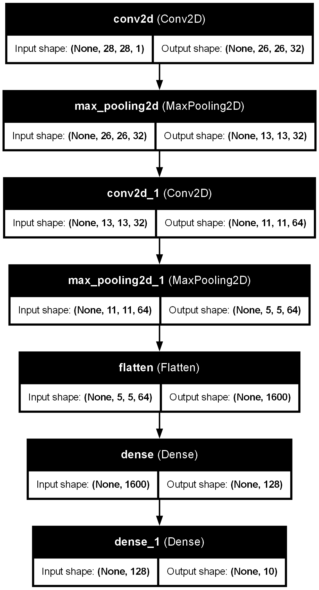

# MNIST Digit Classification with CNN and Streamlit UI

This project demonstrates a Convolutional Neural Network (CNN) model to classify handwritten digits from the MNIST dataset. The system also includes a simple user interface (UI) built with Streamlit for real-time digit prediction using the trained model. The UI allows users to draw digits and get predictions from the CNN model.

## Overview

The MNIST dataset consists of 28x28 pixel images of handwritten digits (0-9). This project uses a Convolutional Neural Network (CNN) to classify these images with high accuracy. A simple UI built with **Streamlit** allows users to draw digits on a canvas and get predictions from the trained model.

### Features:
- Trained CNN model for digit recognition.
- Option to draw digits on a canvas and instantly get a prediction.

## Technologies Used

- **Python**: Programming language for the project.
- **TensorFlow / Keras**: For building and training the CNN model.
- **Streamlit**: For creating the user interface.
- **NumPy**: For numerical operations and data manipulation.
- **Matplotlib**: For visualizing results (if applicable).

## Setup

### Prerequisites:
Make sure you have the following installed:
- Python 3.12

### Installation Steps:

1. Clone the repository:
    ```bash
    git clone https://github.com/vishalgupta-git/Digit_Classification_MNIST
    cd mnist-cnn-streamlit
    ```

2. Install the required dependencies:
    ```bash
    pip install -r requirements.txt
    ```

3. Ensure that you have TensorFlow and Streamlit installed:
    ```bash
    pip install tensorflow streamlit
    ```

## Model Details

The CNN model used in this project consists of the following layers:

1. **Convolutional Layer**: 32 filters, kernel size (3x3), activation function `ReLU`.
2. **Max-Pooling Layer**: Pool size (2x2).
3. **Convolutional Layer**: 64 filters, kernel size (3x3), activation function `ReLU`.
4. **Max-Pooling Layer**: Pool size (2x2).
5. **Fully Connected Layer**: 128 units, activation function `ReLU`.
6. **Output Layer**: 10 units (one for each digit), activation function `softmax`.

The model is trained on the MNIST dataset with sparse categorical cross-entropy loss and Adam optimizer.

### Training:
- The model is trained for 10 epochs with a batch size of 128.
- The training accuracy is typically around 99.2% on the MNIST test set.

### Model Architecture:

Below is the architecture of the CNN model used in this project:



## User Interface

The UI is built using **Streamlit**, and it allows users to draw digits on a canvas and get predictions from the trained CNN model.

### Features of the UI:
1. **Canvas**: Users can draw a digit using their mouse.
2. **Prediction**: Once the user has drawn the digit, the model predicts the number.
3. **Clear Canvas**: Allows users to clear the canvas and draw a new digit.

### Example Workflow:
1. Draw a digit on the canvas.
2. Click the "Predict" button to get the prediction from the model.
3. See the predicted digit displayed on the UI.

## Running the Application

1. **Start the Application**:
    To launch the application, run the following command:
    ```bash
    streamlit run app.py
    ```

2. A new browser window should open with the Streamlit app, or the terminal will show a local URL (e.g., `http://localhost:8501`). Open this URL in your browser.

3. The Streamlit interface will allow you to draw a digit and get a real-time prediction by clicking the **"Predict"** button.

## License

This project is licensed under the MIT License - see the [LICENSE](LICENSE) file for details.

---
